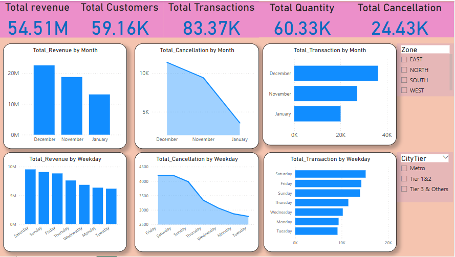

# Retail Sales Dashboard – Power BI

This interactive Power BI dashboard provides a comprehensive overview of retail performance across time, geography, and customer behavior dimensions.

## Dashboard Page: Retail Overview

### Key Metrics (KPIs)
- Total Revenue
- Total Customers
- Total Transactions
- Total Quantity Sold
- Total Cancellations

### Visualizations
- **Total Revenue by Month** (Clustered column chart)
- **Total Cancellations by Month** (Stacked area chart)
- **Total Transactions by Month** (Stacked bar chart)
- **Total Revenue by Weekday** (Clustered column chart)
- **Total Cancellations by Weekday** (Stacked area chart)
- **Total Transactions by Weekday** (Stacked bar chart)

### Interactive Filters (Slicers)
- **Zone** (Geographical segmentation)
- **City Tier** (City classification)

## Objective
This dashboard helps monitor sales trends, customer behavior, and cancellation patterns. It supports business decisions by providing time-based and regional insights.

## Tools Used
- Power BI
- Excel (for raw data processing)

## Screenshot

